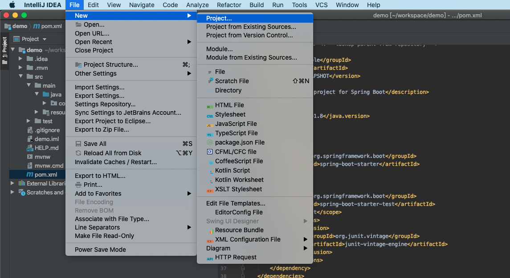
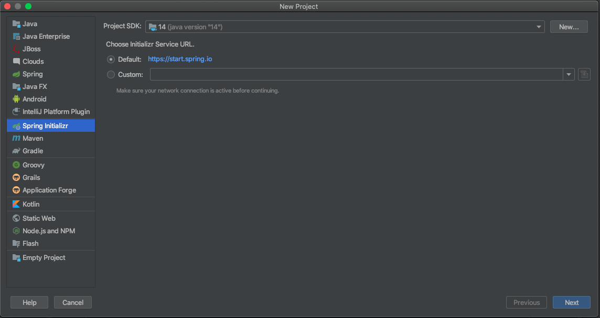
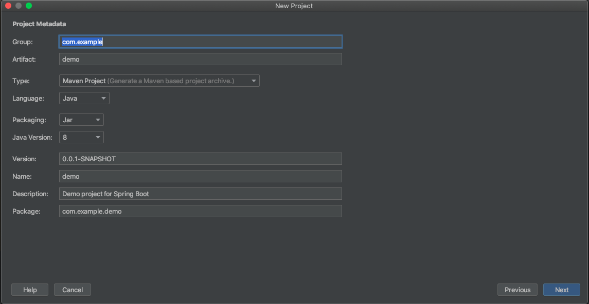
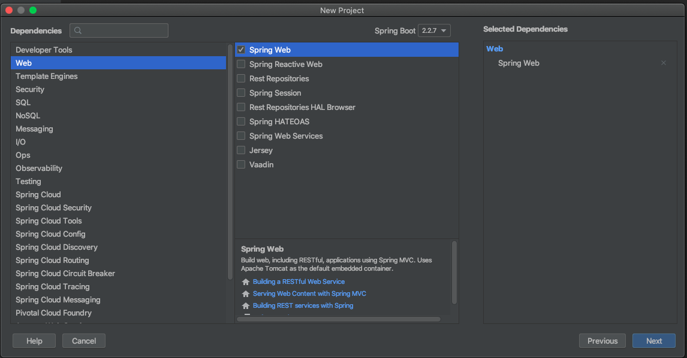
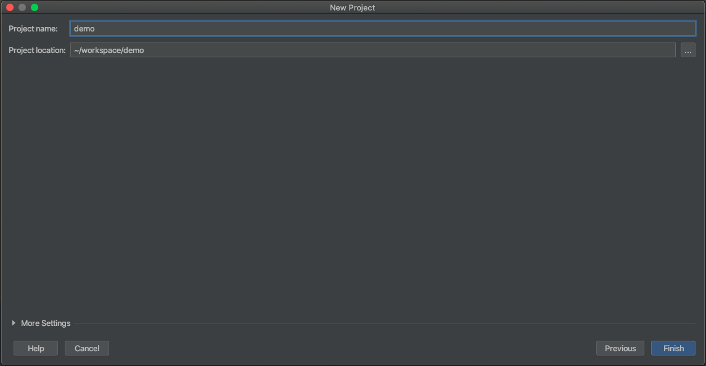
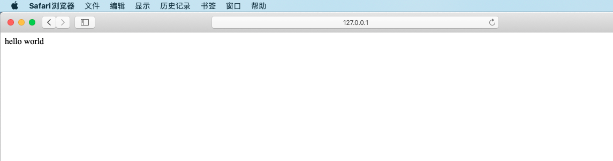

<h1 style="font-size: 2.5em;"> Spring Boot 初体验</h1>
 


参考:[Java视频教程-SpringBoot教程免费分享](https://zhuanlan.zhihu.com/p/47908153)

## 新建项目











## 新建 Controller 

`````
@Controller
public class AppController {
    @RequestMapping("/index")
    @ResponseBody
    public String hello() {
        return "hello world";
    }
}
`````

## 运行 Application 的 main 方法

**运行结果**




