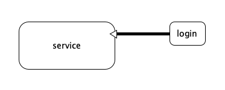

<h1 style="font-size: 2.5em;"> Spring ÃæÏòÇĞÃæ±à³Ì</h1>
 

## �么是��切�编程

传统编程模�如下图所�


横�切�编程模�如下图所�



结论：如图所示，service 在�些情况下��登陆�能执行下�，此时�<span style="color:red">��切�编程</span>作为的指导�想，就�以在service��进login�程�


## spring �� ��切�编程

```````
package com.example.common;

public class Login implements MethodBeforeAdvice {
    @Override
    void before(Method method, Object[] args, Object target) throws Throwable{
        if(!isLogin){
            throw new LoginException("no login");
        }
    }
}

```````
`````
package com.example.service;

public interface BaseService {
    public void action();
}

`````

`````
package com.example.service;

public class UserService implements BaseService {

    public void action(){
        // do something;
    }
}

`````

`````
package com.example.controller;

public class UserController {

    public void showList(){

        ApplicationContext context = new ClassPathXmlApplicationContext("beans.xml");
        UserService service = context.getBean("userService");
        service.action();
    }
}
`````

`````
beans.xml文件

<beans>
    <bean name="userService" class="com.example.service.UserService" />
    <bean name="login" class="com.example.common.Login" />
    <aop:config>
        <aop:pointcut 
            id="loginCheck" 
            expression="execution(* com.example.service.BaseService.add())" />
        <aop:advice
            advice-ref="login" pointcut-ref="loginCheck" />
    </aop:config>
</beans>
`````

以上是在执行 Service.action **之�**添加登陆�查�如�需�在 Service.action **之�**执行，则�� AfterReturningAdvice ���
