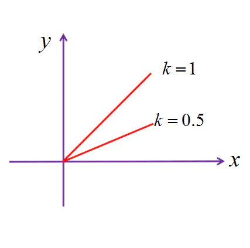

<h1 style="font-size: 2.5em;"> Android Touch �жϺ����򻬶�</h1>
 

# �?�?
`````
xDiff * 0.5f > yDiff
//表明是横向滑�?
`````

斜率小于0.5时，则是横（竖）向移动，斜率是什么呢？高中数学可知，在第�?象限中，越靠近y轴的直线，斜率越大，越靠近x轴直线斜率越小，先看�?单图示：


 

# 参�??
[ViewPager源码分析�?2）：滑动及冲突处理](https://www.jianshu.com/p/ea5de4925b36)