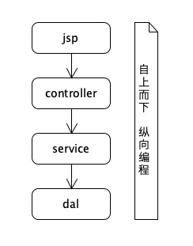
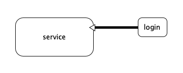

## 什么是面向切面编程

传统编程模式如下图所示



横向切面编程模式如下图所示



结论：如图所示，service 在某些情况下需要登陆才能执行下去，此时以<span style="color:red">面向切面编程</span>作为的指导思想，就可以在service前插进login流程。


## spring 实现 面向切面编程

```````
package com.example.common;

public class Login implements MethodBeforeAdvice {
    @Override
    void before(Method method, Object[] args, Object target) throws Throwable{
        if(!isLogin){
            throw new LoginException("no login");
        }
    }
}

```````
`````
package com.example.service;

public interface BaseService {
    public void action();
}

`````

`````
package com.example.service;

public class UserService implements BaseService {

    public void action(){
        // do something;
    }
}

`````

`````
package com.example.controller;

public class UserController {

    public void showList(){

        ApplicationContext context = new ClassPathXmlApplicationContext("beans.xml");
        UserService service = context.getBean("userService");
        service.action();
    }
}
`````

`````
beans.xml文件

<beans>
    <bean name="userService" class="com.example.service.UserService" />
    <bean name="login" class="com.example.common.Login" />
    <aop:config>
        <aop:pointcut 
            id="loginCheck" 
            expression="execution(* com.example.service.BaseService.add())" />
        <aop:advice
            advice-ref="login" pointcut-ref="loginCheck"
            />
    </aop:config>
</beans>
`````

以上是在执行 Service.action **之前**添加登陆检查。如果需要在 Service.action **之后**执行，则实现 AfterReturningAdvice 接口。
