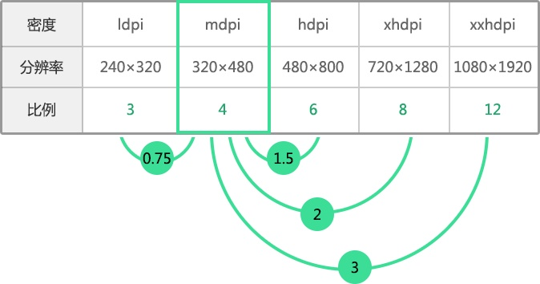

<h1 style="font-size: 2.5em;"> Android 屏幕适配的策略，方案和备注</h1>
 

Reference:[android机型适配终极篇](https://blog.csdn.net/dfskhgalshgkajghljgh/article/details/50564682)

## 单套图or多套图？

google说明是用多套图的，但很多应用选择单套图。

2种方式的显示效果是一样的。

设备在显示图片的时候会选择最合适自己的那套图，如果没有则拿其他文件夹的图做压缩或者放大处理

Google之所以说明用多套图，是因为Google Play会根据不同的设备只输出某一套图。

## SP和DP的选择？

如果需要在应用里面自己实现大中小字体，选择DIP，如果用系统的大中小字体，则用SP。

参考：[SP与DP的区别](https://zhuanlan.zhihu.com/p/25277416)

## 设备是如何选择使用哪一套图的？

1. 根据 width 和 heigh 得到对角线的长度（勾股定理）
1. 密度 ＝ 对角线的长度 / 屏幕大小(4.5英寸，5.5英寸)
1. 根据下表，找一个密度值最接近的就是该文件夹的套图

这里写图片描述

**以 小米1s 为例， 4.7  1280x720    密度：312.5     xhdpi**

上面求出的是实际密度，系统是有系统密度的。

## dp(dip) 和 px 的关系

在安卓中，系统密度为160dpi的中密度(mdpi)手机屏幕为基准屏幕。在这个屏幕中，1dp=1px。 
<table>
<thead>
<tr>
<th>密度</th>
<th>dp/px</th>
</tr>
</thead>
<tbody>
<tr>
<td>ldpi</td>
<td>1dp = 0.75px</td>
</tr>
<tr>
<td>mdpi</td>
<td>1dp = 1px</td>
</tr>
<tr>
<td>hdpi</td>
<td>1dp = 1.5px</td>
</tr>
<tr>
<td>xhdpi</td>
<td>1dp = 2px</td>
</tr>
<tr>
<td>xxhdpi</td>
<td>1dp = 3px</td>
</tr>
</tbody>
</table>

这里写图片描述 

## 图片显示情况情况

假设：100px x 100px 的图片放在 mdpi中  则可以理解为 图片的长宽是 100dp x 100dp

那么在xhdpi的显示情况是：100dp x 100dp  ----> 200px x 200px

其他密度设备的情况按上述换装。

总结：转换为dp，以dp为主。

## IOS和Android一套图的适配总结

<table>
<thead>
<tr>
<th>设备型号</th>
<th>分辨率</th>
<th>尺寸</th>
<th>密度值</th>
<th>密度区域</th>
</tr>
</thead>
<tbody>
<tr>
<td>Iphone 5</td>
<td>640 x 1130</td>
<td>4.0</td>
<td>325</td>
<td>xhdpi</td>
</tr>
<tr>
<td>Iphone 6</td>
<td>750 x 1334</td>
<td>4.7</td>
<td>325</td>
<td>xhdpi</td>
</tr>
<tr>
<td>红米1s</td>
<td>720 x 1280</td>
<td>4.7</td>
<td>312.5</td>
<td>xhdpi</td>
</tr>
</tbody>
</table>
分2种情况讨论：

1. 一般设值

    根据UI图标注的尺寸除以2
1. 图片

    给2倍图

如果要求 iphone6 和 红迷1s 的显示效果完全一致（两者都是 4.7 英寸，长宽比都是1.77），但只有一套iphone6的图

    DP = PX x (720 / 750)  / 2 = PX x 0.48

## 主题适配

需要设置自己的主题，如字体大小，控件样式等等，具体参考项目 Style.xml 源码。

建议使用最低支持版本的默认样式，否则需要兼容包。有些地方，即使使用了兼容包，依然不能在低版本中呈现效果

## 我的特殊适配方案

按比例绘图。
